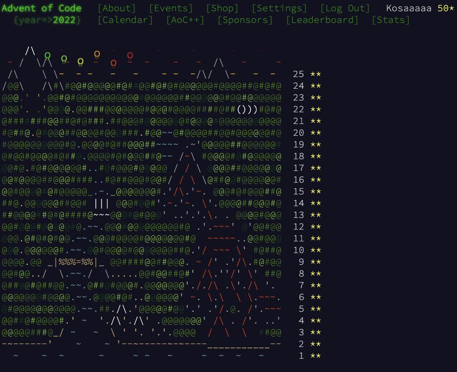
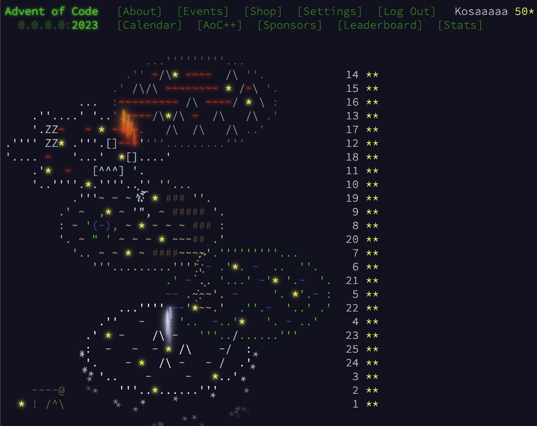

# Advent Of Code since 2022

## Automated Monorepo for solving Advent Of Code Puzzles

Inspired by: [@anthonywritescode](https://github.com/anthonywritescode)

## Usage

### Install requirements

* basic
    * `pip install -r requirements.txt`
* development with pre-commit
    * `pip install -r requirements.dev.txt`
    * `pre-commit install`

### Running

1. Download daily input
   `cd aoc2022/day01 && aoc-download-input`
2. Run unit test per part
   `pytest part1.py`
3. Run part with provided input
   `python part1.py input.txt | aoc-submit --part 1`
4. Submitting second part of 25th day is diffrent
   `python part2.py input.txt | aoc-25-pt2`

## Hall of Fame

